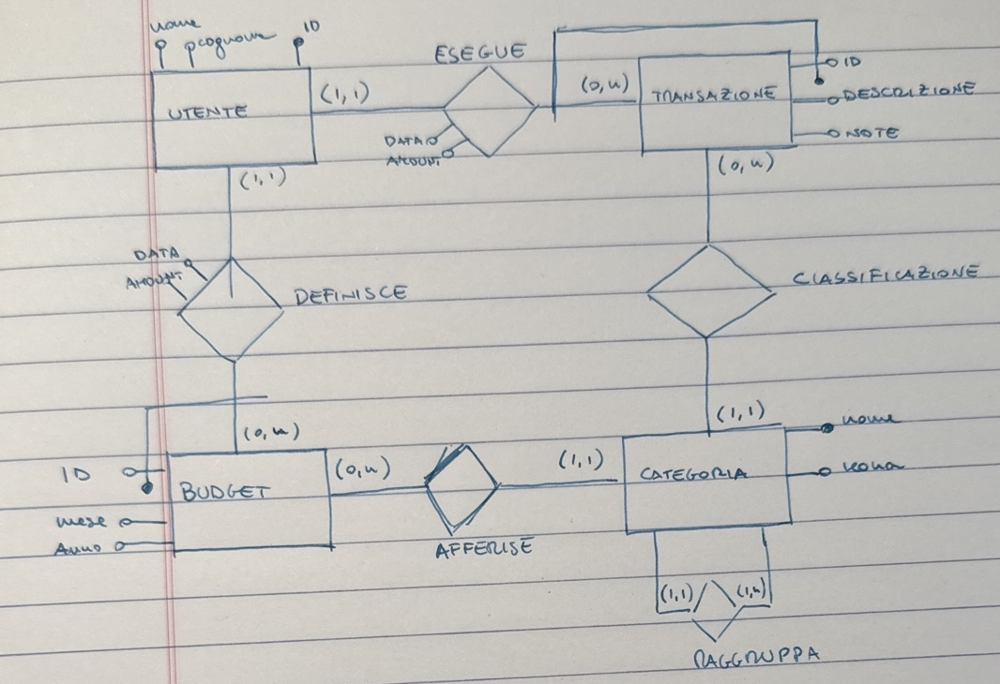
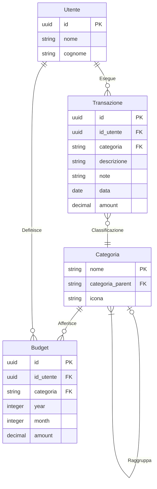

# Datamodel
Questo file contiene tutte le informazioni riguardo al data model di LIFE SH.

## Budgeting
Si vuole creare il data model per un'applicazione che permetta di monitorare le spese effettuate in un dato periodo ti tempo e rispetto a un budget mensile prefissato. La visualizzazione deve essere disponibile per mese e con una visuale aggreggata annuale.

### Descrizione del data model
L'applicazione tiene traccia di tutte le transazioni effettuate. Una transazione è caratterizzata da un nome da una categoria, da un importo, da una data e da un campo note opzionale. Le categorie sono le seguenti:

== Necessità ==
* 🏠 Casa
* 🍲 Cibo/Spesa
* 🚑 Sanità
* 🏋️ Palestra e affini
* 📱 Telefono
* 🚌 Trasporti
* 👕 Vestiti

== Extra ==
* 🎫 Abbonamenti
* 🍔 Cibo fuori
* 🎬 Intrattenimento
* 🎁 Regali
* ✈️ Viaggi/Vacanze
* 📚 Cultura
* 💅 Cura personale
* 🌟 Altro extra

== Entrate ==
* 🤑 Stipendio
* 🪙 Altre entrate

== Finanza ==
* 🏦 Aumento Capitale
* 💹 Investimento
* 🟥 Costo Debito

Le categorie devono essere gestite come una gerarchia, con la possibilità di gestire diversi livelli di dettaglio.
Le categorie sono caratterizzate da un nome e da un'icona (da capire come inserirla e come gestirla). Idealmente queste categorie devono essere facilmenti configurabili. Ogni mese è possibile definire un budget. Il budget è unico per anno e per mese, e consente di stabilire una soglia di spesa per una data categoria.
Il data model è il seguente

